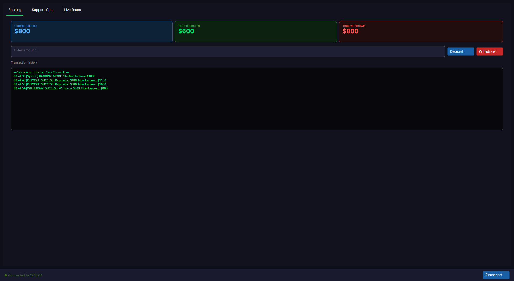
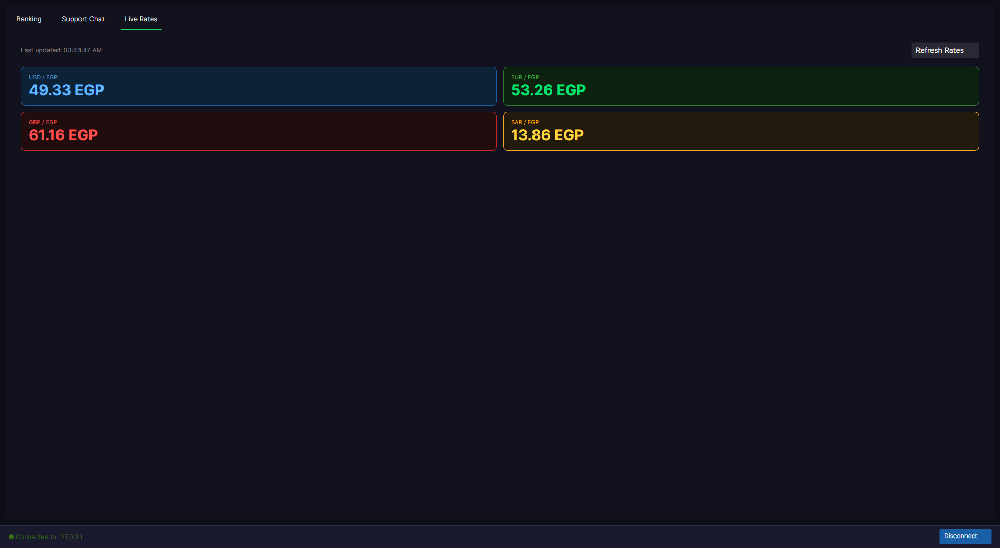
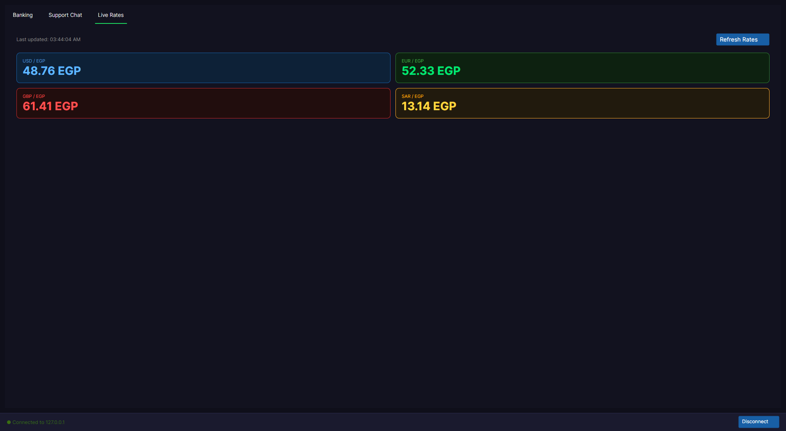
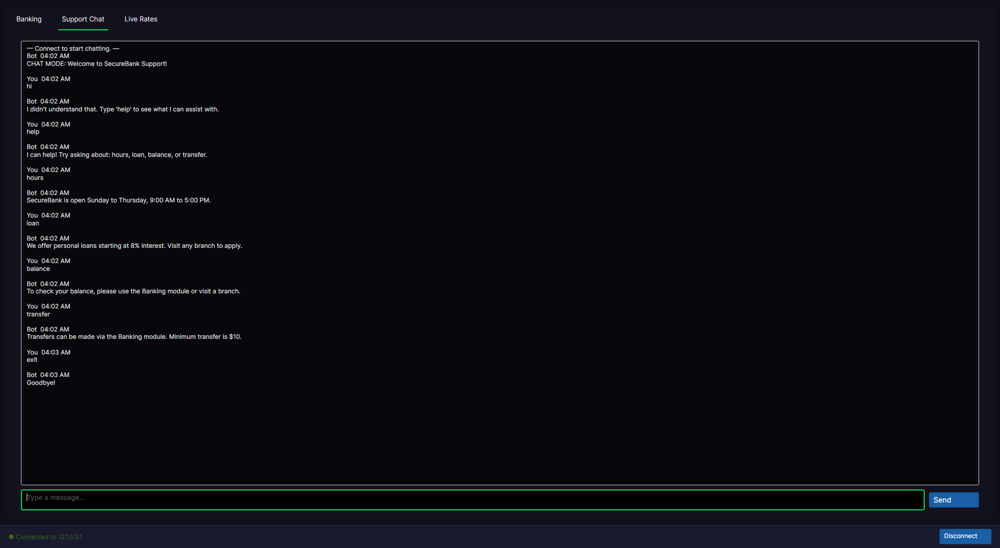
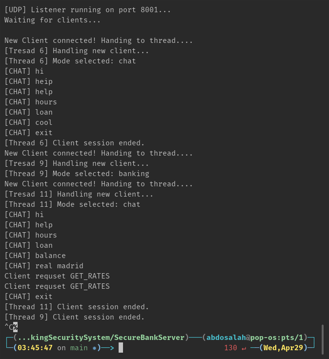
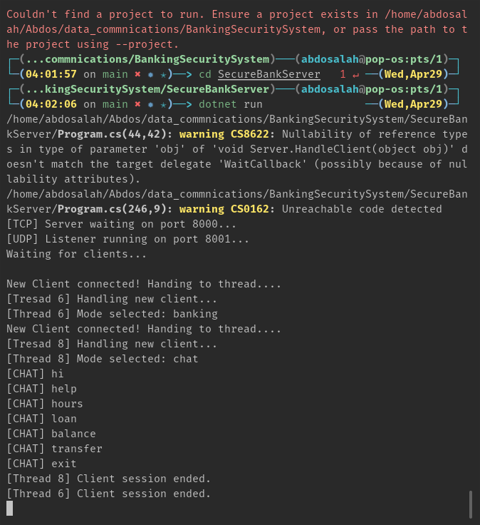

# 🏦 SecureBank Transaction & Support System

> A multithreaded client-server banking simulation built in C# .NET — demonstrating TCP, UDP, and concurrent socket programming with a cross-platform Avalonia GUI.

---

## 📸 Screenshots

### Banking Module
 
 

### Live Exchange Rates



### ChatBot Module
  

### Server Console


---

## 📌 Overview

**SecureBank** is a comprehensive networking project that simulates a real-world banking communication system. It implements a unified architecture where a central multithreaded server concurrently manages multiple client connections across three distinct functional modules.

Built as part of the **Data Communication course (2025–2026)** under TA Ragab S. Bakhit.

---

## 🏗️ Architecture

┌─────────────────────────────────────────────────────┐
│                  SecureBank Server                  │
│                                                     │
│   TCP Socket (Port 8000)      UDP Socket (Port 8001)│
│          │                           │              │
│    ┌─────▼──────┐             ┌──────▼─────┐        │
│    │ ThreadPool │             │ UDP Thread │        │
│    └─────┬──────┘             └──────┬─────┘        │
│          │                           │              │
│   ┌──────┴──────┐             ┌──────▼─────┐        │
│   │             │             │ Live Ticker│        │
│   ▼             ▼             └────────────┘        │
│ Banking       Chat                                  │
│ Handler       Handler                               │
└─────────────────────────────────────────────────────┘
---

## ✨ Features

### Module A — Banking Transactions (TCP)
- Deposit and withdraw funds using structured commands
- Real-time balance tracking with overdraft protection
- Full transaction history log in the GUI
- Confirmation or error response for every transaction

### Module B — Support Chatbot (TCP)
- Natural language keyword detection (help, hours, loan, balance, transfer)
- Automated predefined responses over persistent TCP connection
- Graceful session termination with exit command

### Module C — Live Exchange Rates (UDP)
- Connectionless rate requests using GET_RATES
- Simulated real-time EGP exchange rates (USD, EUR, GBP, SAR)
- Rates update on every refresh click
- No handshake overhead — pure UDP datagram communication

### Concurrency
- Multithreaded server using ThreadPool.QueueUserWorkItem
- Main thread never blocks — always ready for new connections
- UDP listener runs on a dedicated background thread

### GUI (Avalonia — cross-platform)
- Dark mode interface
- Three-tab layout: Banking, Support Chat, Live Rates
- Real-time balance metric cards
- Terminal-style transaction history log
- Chat bubble interface for support bot
- Color-coded currency rate cards

---

## 🛠️ Tech Stack

| Component | Technology |
|---|---|
| Language | C# (.NET 10) |
| GUI Framework | Avalonia UI (cross-platform) |
| TCP Communication | System.Net.Sockets — Stream/TCP |
| UDP Communication | System.Net.Sockets — Dgram/UDP |
| Concurrency | System.Threading.ThreadPool |
| Encoding | System.Text.Encoding.ASCII |
| Platform | Linux / Windows / macOS |

---

## 📁 Project Structure
BankingSecuritySystem/
│
├── SecureBankServer/
│   └── Program.cs
│       ├── Main()              TCP accept loop + UDP thread
│       ├── HandleClient()      ThreadPool entry point
│       ├── HandleBanking()     Module A logic
│       ├── HandleChat()        Module B logic
│       ├── StartUDPListener()  Module C logic
│       ├── ProcessCommand()    DEPOSIT/WITHDRAW parser
│       ├── GetBotReply()       Keyword matching engine
│       └── BuildRates()        Exchange rate generator
│
├── SecureBankGUI/
│   ├── MainWindow.axaml        UI layout
│   ├── MainWindow.axaml.cs     UI logic
│   └── Clients/
│       ├── BankingClient.cs    TCP banking socket
│       ├── ChatClient.cs       TCP chat socket
│       └── RatesClient.cs      UDP rates socket
│
├── screenshots/
└── README.md
---

## 🚀 Getting Started

### Prerequisites
- .NET 10 SDK — https://dotnet.microsoft.com/download
- VS Code with C# extension (or any IDE)

### Run the Server

```bash
cd SecureBankServer
dotnet run
```

Expected output:
[TCP] Server running on port 8000...
[UDP] Listener running on port 8001...
Waiting for clients...

### Run the GUI Client

```bash
cd SecureBankGUI
dotnet run
```

Click **Connect** in the bottom right to connect to the server.

---

## 💻 Usage

### Banking Tab
Click Connect
Enter amount in the text box
Click Deposit or Withdraw
Balance updates immediately
Transaction history logs every action
### Support Chat Tab
Type any message and press Enter or Send:
"help"     → shows available topics
"hours"    → shows working hours
"loan"     → shows loan information
"balance"  → directs to banking module
"transfer" → shows transfer info

### Live Rates Tab
Click Refresh Rates to get current EGP exchange rates:
USD / EGP
EUR / EGP
GBP / EGP
SAR / EGP

---

## 🔑 Key Concepts Demonstrated

| Concept | Implementation |
|---|---|
| TCP three-way handshake | Connect() → Accept() |
| Persistent connection | while(true) Send/Receive loop |
| Connectionless communication | SendTo() / ReceiveFrom() |
| Non-blocking server | ThreadPool.QueueUserWorkItem() |
| Protocol selection | TCP for reliability, UDP for speed |
| Graceful shutdown | Shutdown() then Close() |
| Cross-platform GUI | Avalonia UI with async/await |

---

## 🔌 Port Reference

| Port | Protocol | Module |
|---|---|---|
| 8000 | TCP | Banking + Chat |
| 8001 | UDP | Live Ticker |

---

## 🔮 Possible Extensions

- [ ] Authentication — login before transactions
- [ ] Server logging — timestamped server_log.txt
- [ ] Multiple accounts — per-user balance tracking
- [ ] Persistent balance — save/load from file

---

## 👨‍💻 Author

Built for **Data Communication Course — 2025/2026**
Faculty of Computers and Information

---

## 📄 License

This project is for educational purposes.
